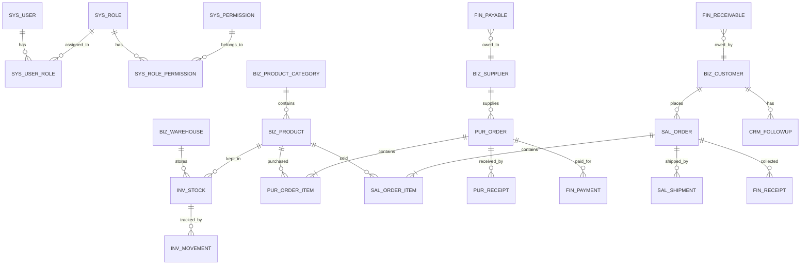

# 🏗️ 系统架构设计文档 (ARCHITECTURE_SPEC.md)

## 1. 架构概览

### 1.1 架构模式
**模块化单体架构 (Modular Monolith)**

- 针对小型 ERP 的最优选择，运维成本低，开发效率高
- 后续可按需拆分为微服务（如订单服务、库存服务、财务服务）

### 1.2 技术栈

| 层级 | 技术选型 | 说明 |
|:---|:---|:---|
| **前端** | Vue.js 3 + Element Plus | 轻量高效，组件丰富 |
| **后端** | Java 17 + Spring Boot 3 | 企业级标准，生态成熟 |
| **数据库** | PostgreSQL 16 | 支持复杂查询、JSON 字段、事务完整性 |
| **缓存** | Redis 7（可选） | 用于会话管理、热点数据缓存 |
| **构建工具** | Maven / Gradle | 项目构建与依赖管理 |
| **API 文档** | Swagger/OpenAPI 3.0 | 接口文档自动生成 |

### 1.3 部署拓扑

```
┌─────────────────────────────────────────────────────────┐
│                      客户端层                           │
│     PC 浏览器 (Chrome/Edge/Firefox) × 2-3 台           │
└──────────────────────┬──────────────────────────────────┘
                       │ HTTP/WebSocket
┌──────────────────────▼──────────────────────────────────┐
│                   Nginx 反向代理                        │
└──────────────────────┬──────────────────────────────────┘
                       │
┌──────────────────────▼──────────────────────────────────┐
│              Spring Boot 应用 (单体)                    │
│  ┌─────────┬─────────┬─────────┬─────────┬─────────┐  │
│  │ 认证模块 │ 进销存模块 │ 财务模块 │ 报表模块 │ 系统模块 │  │
│  └─────────┴─────────┴─────────┴─────────┴─────────┘  │
└──────────────┬────────────────┬─────────────────────────┘
               │                │
┌──────────────▼────────┐ ┌────▼──────────────────────────┐
│   PostgreSQL 16       │ │     Redis 7 (可选)           │
│   ┌────────────────┐  │ │  ┌────────────────────────┐  │
│   │ 业务数据      │  │ │  │ Session / 缓存        │  │
│   │ 系统数据      │  │ │  └────────────────────────┘  │
│   └────────────────┘  │ └─────────────────────────────┘
└──────────────────────┘
```

---

## 2. 数据库设计 (核心)

### 2.1 ER 图



### 2.2 核心表结构定义

#### 系统权限模块

| 表名 | 描述 | 关键字段 | 索引策略 |
|:---|:---|:---|:---|
| `sys_user` | 用户表 | id, username, password_hash, real_name, email, phone, status, dept_id | `idx_username`, `idx_status` |
| `sys_role` | 角色表 | id, role_code, role_name, description, sort_order | `uniq_code` |
| `sys_permission` | 权限表 | id, perm_code, perm_name, resource_type, resource_path, method | `idx_resource` |
| `sys_user_role` | 用户角色关联 | id, user_id, role_id | `idx_user_id` |
| `sys_role_permission` | 角色权限关联 | id, role_id, permission_id | `idx_role_id` |
| `sys_dept` | 部门表 | id, dept_name, parent_id, sort_order, leader | `idx_parent` |

#### 基础数据模块

| 表名 | 描述 | 关键字段 | 索引策略 |
|:---|:---|:---|:---|
| `biz_warehouse` | 仓库表 | id, warehouse_code, warehouse_name, address, manager_id, is_default | `uniq_code` |
| `biz_product_category` | 商品分类表 | id, category_code, category_name, parent_id, level, sort_order | `idx_parent` |
| `biz_product` | 商品表 | id, product_code, product_name, category_id, spec, unit, cost_price, sale_price, min_stock, is_enabled | `uniq_code`, `idx_category` |
| `biz_customer` | 客户表 | id, customer_code, customer_name, contact, phone, address, credit_limit, sales_id | `uniq_code`, `idx_sales` |
| `biz_supplier` | 供应商表 | id, supplier_code, supplier_name, contact, phone, address, credit_period | `uniq_code` |

#### 采购模块

| 表名 | 描述 | 关键字段 | 索引策略 |
|:---|:---|:---|:---|
| `pur_order` | 采购单主表 | id, order_no, supplier_id, warehouse_id, total_amount, status, order_date, created_by | `uniq_order_no`, `idx_status`, `idx_date` |
| `pur_order_item` | 采购单明细 | id, order_id, product_id, quantity, price, tax_rate, subtotal | `idx_order_id`, `idx_product` |
| `pur_receipt` | 采购入库单 | id, receipt_no, order_id, warehouse_id, receipt_date, created_by | `uniq_receipt_no`, `idx_order` |

#### 销售模块

| 表名 | 描述 | 关键字段 | 索引策略 |
|:---|:---|:---|:---|
| `sal_order` | 销售单主表 | id, order_no, customer_id, warehouse_id, total_amount, status, order_date, created_by | `uniq_order_no`, `idx_status`, `idx_date` |
| `sal_order_item` | 销售单明细 | id, order_id, product_id, quantity, price, tax_rate, subtotal, cost_price | `idx_order_id`, `idx_product` |
| `sal_shipment` | 销售出库单 | id, shipment_no, order_id, warehouse_id, shipment_date, created_by | `uniq_shipment_no`, `idx_order` |

#### 库存模块

| 表名 | 描述 | 关键字段 | 索引策略 |
|:---|:---|:---|:---|
| `inv_stock` | 库存表 | id, warehouse_id, product_id, quantity, locked_qty, avg_cost | `uniq_warehouse_product`, `idx_product` |
| `inv_movement` | 库存变动流水 | id, warehouse_id, product_id, movement_type, quantity, before_qty, after_qty, order_no, movement_date | `idx_product`, `idx_date`, `idx_order` |
| `inv_alert` | 库存预警表 | id, warehouse_id, product_id, alert_type, current_qty, alert_qty, is_resolved | `idx_warehouse`, `idx_product`, `idx_resolved` |

#### 财务模块

| 表名 | 描述 | 关键字段 | 索引策略 |
|:---|:---|:---|:---|
| `fin_receivable` | 应收账款 | id, customer_id, order_id, order_type, amount, paid_amount, balance, due_date, status | `idx_customer`, `idx_status`, `idx_due` |
| `fin_payable` | 应付账款 | id, supplier_id, order_id, order_type, amount, paid_amount, balance, due_date, status | `idx_supplier`, `idx_status`, `idx_due` |
| `fin_receipt` | 收款单 | id, receipt_no, customer_id, amount, payment_method, receipt_date | `uniq_receipt_no`, `idx_customer`, `idx_date` |
| `fin_payment` | 付款单 | id, payment_no, supplier_id, amount, payment_method, payment_date | `uniq_payment_no`, `idx_supplier`, `idx_date` |
| `fin_invoice` | 发票管理 | id, invoice_no, invoice_type, order_id, amount, tax_amount, status, invoice_date | `uniq_invoice_no`, `idx_order`, `idx_type` |
| `fin_period` | 会计期间 | id, period_code, start_date, end_date, is_closed, closed_at | `uniq_period`, `idx_status` |

#### CRM 模块

| 表名 | 描述 | 关键字段 | 索引策略 |
|:---|:---|:---|:---|
| `crm_followup` | 客户跟进记录 | id, customer_id, followup_type, content, followup_date, next_date, created_by | `idx_customer`, `idx_date` |

### 2.3 核心字段说明

**审计字段**（所有业务表必备）:
```sql
created_by     BIGINT      -- 创建人ID
created_at     TIMESTAMP   -- 创建时间
updated_by     BIGINT      -- 更新人ID
updated_at     TIMESTAMP   -- 更新时间
is_deleted     BOOLEAN     -- 软删除标记
```

**软删除策略**: 所有业务表采用软删除，数据可追溯、可恢复

---

## 3. 权限与安全设计

### 3.1 RBAC 权限模型

```
用户 (User) ←→ 角色 (Role) ←→ 权限 (Permission)
                    ↓
                 数据范围
```

**预定义角色**:
| 角色编码 | 角色名称 | 说明 |
|:---|:---|:---|
| `ROLE_ADMIN` | 系统管理员 | 拥有所有权限 |
| `ROLE_OWNER` | 企业主 | 拥有业务数据全部权限 |
| `ROLE_SALESMAN` | 销售员 | 仅销售相关权限 |
| `ROLE_WAREHOUSE` | 仓库管理员 | 仅库存相关权限 |
| `ROLE_ACCOUNTANT` | 财务 | 仅财务相关权限 |

### 3.2 数据范围权限

| 权限类型 | 说明 | 示例 |
|:---|:---|:---|
| **全部数据** | 可查看所有数据 | 管理员、企业主 |
| **本部门数据** | 仅本部门 | 部门经理 |
| **本人数据** | 仅自己创建 | 销售员（自己的客户） |
| **指定仓库** | 指定仓库数据 | 仓库管理员 |

### 3.3 安全策略

| 安全项 | 方案 |
|:---|:---|
| **认证机制** | JWT + Refresh Token 双token机制 |
| **密码加密** | BCrypt 哈希算法 |
| **敏感数据加密** | AES-256 加密（客户信息、价格策略等） |
| **SQL 防注入** | MyBatis/JPA 参数化查询 |
| **XSS 防护** | 前后端输入过滤 + CSP 头 |
| **审计日志** | 记录所有写操作 (Who, When, What, IP, Result) |
| **数据备份** | 每日自动备份，保留 30 天 |

---

## 4. 接口规范

### 4.1 URL 命名规范

```
/api/v1/{模块}/{资源}/{操作}

示例:
GET    /api/v1/products              # 商品列表
GET    /api/v1/products/{id}         # 商品详情
POST   /api/v1/products              # 创建商品
PUT    /api/v1/products/{id}         # 更新商品
DELETE /api/v1/products/{id}         # 删除商品
POST   /api/v1/purchase-orders       # 创建采购单
PUT    /api/v1/purchase-orders/{id}/approve  # 审核采购单
```

### 4.2 统一响应结构

```json
{
  "code": 200,
  "msg": "success",
  "data": {
    "id": 1001,
    "orderNo": "PUR-20240301-001"
  },
  "traceId": "a1b2c3d4-e5f6-7890-g1h2-i3j4k5l6m7n8",
  "timestamp": 1709260800000
}
```

### 4.3 错误码字典

| 错误码 | 说明 |
|:---|:---|
| 200 | 成功 |
| 400 | 请求参数错误 |
| 401 | 未认证 |
| 403 | 无权限 |
| 404 | 资源不存在 |
| 1001 | 库存不足 |
| 1002 | 单据已审核，不可修改 |
| 1003 | 会计期间已结账 |
| 9999 | 系统内部错误 |

---

## 5. 开发指引

### 5.1 项目目录结构

```
cc-erp/
├── cc-erp-backend/                 # 后端项目
│   ├── src/main/java/com/cc/erp/
│   │   ├── controller/             # 控制器层
│   │   │   ├── product/
│   │   │   ├── purchase/
│   │   │   ├── sales/
│   │   │   ├── inventory/
│   │   │   ├── finance/
│   │   │   └── system/
│   │   ├── service/                # 服务层
│   │   │   ├── impl/
│   │   ├── repository/             # 数据访问层
│   │   ├── entity/                 # 实体类
│   │   ├── dto/                    # 数据传输对象
│   │   ├── vo/                     # 视图对象
│   │   ├── config/                 # 配置类
│   │   ├── security/               # 安全模块
│   │   ├── exception/              # 异常处理
│   │   └── util/                   # 工具类
│   └── src/main/resources/
│       ├── mapper/                 # MyBatis XML
│       ├── application.yml         # 配置文件
│       └── db/
│           └── migration/          # 数据库迁移脚本
├── cc-erp-frontend/                # 前端项目
│   ├── src/
│   │   ├── api/                    # API 接口
│   │   ├── views/                  # 页面视图
│   │   ├── components/             # 公共组件
│   │   ├── store/                  # 状态管理
│   │   └── router/                 # 路由配置
└── docs/                           # 项目文档
```

### 5.2 事务管理策略

```java
// 库存扣减采用本地事务 + 乐观锁
@Transactional
public void processSalesOrder(SalesOrderDTO dto) {
    // 1. 校验库存（带锁）
    // 2. 扣减库存
    // 3. 创建销售单
    // 4. 生成应收账款
}
```

### 5.3 关键业务规则

| 规则 | 说明 |
|:---|:---|
| **单据号生成** | `{模块代码}-{yyyyMMdd}-{4位流水号}` 如: `PUR-20240301-0001` |
| **库存扣减** | 采用 `locked_qty` 预占机制，防止超卖 |
| **成本核算** | 采用移动加权平均法 (FIFO/Moving Average) |
| **结账控制** | 结账期间不可新增/修改单据 |
| **并发控制** | 单据审核加版本号乐观锁 |

---

## 📋 附录：数据库初始化脚本

### 建表语句（简化版）

```sql
-- 系统用户表
CREATE TABLE sys_user (
    id BIGSERIAL PRIMARY KEY,
    username VARCHAR(50) UNIQUE NOT NULL,
    password_hash VARCHAR(255) NOT NULL,
    real_name VARCHAR(50),
    phone VARCHAR(20),
    status SMALLINT DEFAULT 1,
    created_at TIMESTAMP DEFAULT CURRENT_TIMESTAMP,
    updated_at TIMESTAMP DEFAULT CURRENT_TIMESTAMP
);

-- 商品分类表
CREATE TABLE biz_product_category (
    id BIGSERIAL PRIMARY KEY,
    category_code VARCHAR(50) UNIQUE NOT NULL,
    category_name VARCHAR(100) NOT NULL,
    parent_id BIGINT,
    level SMALLINT DEFAULT 1,
    sort_order INT DEFAULT 0,
    created_at TIMESTAMP DEFAULT CURRENT_TIMESTAMP
);

-- 商品表
CREATE TABLE biz_product (
    id BIGSERIAL PRIMARY KEY,
    product_code VARCHAR(50) UNIQUE NOT NULL,
    product_name VARCHAR(200) NOT NULL,
    category_id BIGINT REFERENCES biz_product_category(id),
    spec VARCHAR(100),
    unit VARCHAR(20),
    cost_price DECIMAL(10,2) DEFAULT 0,
    sale_price DECIMAL(10,2) DEFAULT 0,
    min_stock INT DEFAULT 0,
    is_enabled BOOLEAN DEFAULT true,
    created_at TIMESTAMP DEFAULT CURRENT_TIMESTAMP,
    updated_at TIMESTAMP DEFAULT CURRENT_TIMESTAMP
);

-- 仓库表
CREATE TABLE biz_warehouse (
    id BIGSERIAL PRIMARY KEY,
    warehouse_code VARCHAR(50) UNIQUE NOT NULL,
    warehouse_name VARCHAR(100) NOT NULL,
    address VARCHAR(200),
    manager_id BIGINT,
    is_default BOOLEAN DEFAULT false,
    created_at TIMESTAMP DEFAULT CURRENT_TIMESTAMP
);

-- 库存表
CREATE TABLE inv_stock (
    id BIGSERIAL PRIMARY KEY,
    warehouse_id BIGINT REFERENCES biz_warehouse(id),
    product_id BIGINT REFERENCES biz_product(id),
    quantity INT DEFAULT 0,
    locked_qty INT DEFAULT 0,
    avg_cost DECIMAL(10,2) DEFAULT 0,
    UNIQUE(warehouse_id, product_id),
    created_at TIMESTAMP DEFAULT CURRENT_TIMESTAMP,
    updated_at TIMESTAMP DEFAULT CURRENT_TIMESTAMP
);

-- 客户表
CREATE TABLE biz_customer (
    id BIGSERIAL PRIMARY KEY,
    customer_code VARCHAR(50) UNIQUE NOT NULL,
    customer_name VARCHAR(100) NOT NULL,
    contact VARCHAR(50),
    phone VARCHAR(20),
    address VARCHAR(200),
    credit_limit DECIMAL(12,2) DEFAULT 0,
    sales_id BIGINT,
    created_at TIMESTAMP DEFAULT CURRENT_TIMESTAMP,
    updated_at TIMESTAMP DEFAULT CURRENT_TIMESTAMP
);

-- 供应商表
CREATE TABLE biz_supplier (
    id BIGSERIAL PRIMARY KEY,
    supplier_code VARCHAR(50) UNIQUE NOT NULL,
    supplier_name VARCHAR(100) NOT NULL,
    contact VARCHAR(50),
    phone VARCHAR(20),
    address VARCHAR(200),
    credit_period INT DEFAULT 0,
    created_at TIMESTAMP DEFAULT CURRENT_TIMESTAMP,
    updated_at TIMESTAMP DEFAULT CURRENT_TIMESTAMP
);

-- 采购单主表
CREATE TABLE pur_order (
    id BIGSERIAL PRIMARY KEY,
    order_no VARCHAR(50) UNIQUE NOT NULL,
    supplier_id BIGINT REFERENCES biz_supplier(id),
    warehouse_id BIGINT REFERENCES biz_warehouse(id),
    total_amount DECIMAL(12,2) DEFAULT 0,
    status SMALLINT DEFAULT 0,
    order_date DATE NOT NULL,
    created_by BIGINT,
    created_at TIMESTAMP DEFAULT CURRENT_TIMESTAMP,
    updated_at TIMESTAMP DEFAULT CURRENT_TIMESTAMP
);

-- 采购单明细
CREATE TABLE pur_order_item (
    id BIGSERIAL PRIMARY KEY,
    order_id BIGINT REFERENCES pur_order(id),
    product_id BIGINT REFERENCES biz_product(id),
    quantity INT NOT NULL,
    price DECIMAL(10,2) NOT NULL,
    tax_rate DECIMAL(5,2) DEFAULT 0,
    subtotal DECIMAL(12,2) NOT NULL,
    created_at TIMESTAMP DEFAULT CURRENT_TIMESTAMP
);

-- 销售单主表
CREATE TABLE sal_order (
    id BIGSERIAL PRIMARY KEY,
    order_no VARCHAR(50) UNIQUE NOT NULL,
    customer_id BIGINT REFERENCES biz_customer(id),
    warehouse_id BIGINT REFERENCES biz_warehouse(id),
    total_amount DECIMAL(12,2) DEFAULT 0,
    status SMALLINT DEFAULT 0,
    order_date DATE NOT NULL,
    created_by BIGINT,
    created_at TIMESTAMP DEFAULT CURRENT_TIMESTAMP,
    updated_at TIMESTAMP DEFAULT CURRENT_TIMESTAMP
);

-- 销售单明细
CREATE TABLE sal_order_item (
    id BIGSERIAL PRIMARY KEY,
    order_id BIGINT REFERENCES sal_order(id),
    product_id BIGINT REFERENCES biz_product(id),
    quantity INT NOT NULL,
    price DECIMAL(10,2) NOT NULL,
    tax_rate DECIMAL(5,2) DEFAULT 0,
    subtotal DECIMAL(12,2) NOT NULL,
    cost_price DECIMAL(10,2),
    created_at TIMESTAMP DEFAULT CURRENT_TIMESTAMP
);

-- 应收账款
CREATE TABLE fin_receivable (
    id BIGSERIAL PRIMARY KEY,
    customer_id BIGINT REFERENCES biz_customer(id),
    order_id BIGINT,
    order_type VARCHAR(20),
    amount DECIMAL(12,2) NOT NULL,
    paid_amount DECIMAL(12,2) DEFAULT 0,
    balance DECIMAL(12,2) NOT NULL,
    due_date DATE,
    status SMALLINT DEFAULT 0,
    created_at TIMESTAMP DEFAULT CURRENT_TIMESTAMP,
    updated_at TIMESTAMP DEFAULT CURRENT_TIMESTAMP
);

-- 应付账款
CREATE TABLE fin_payable (
    id BIGSERIAL PRIMARY KEY,
    supplier_id BIGINT REFERENCES biz_supplier(id),
    order_id BIGINT,
    order_type VARCHAR(20),
    amount DECIMAL(12,2) NOT NULL,
    paid_amount DECIMAL(12,2) DEFAULT 0,
    balance DECIMAL(12,2) NOT NULL,
    due_date DATE,
    status SMALLINT DEFAULT 0,
    created_at TIMESTAMP DEFAULT CURRENT_TIMESTAMP,
    updated_at TIMESTAMP DEFAULT CURRENT_TIMESTAMP
);

-- 索引创建
CREATE INDEX idx_product_category ON biz_product(category_id);
CREATE INDEX idx_pur_order_status ON pur_order(status);
CREATE INDEX idx_pur_order_date ON pur_order(order_date);
CREATE INDEX idx_sal_order_status ON sal_order(status);
CREATE INDEX idx_sal_order_date ON sal_order(order_date);
CREATE INDEX idx_sal_order_customer ON sal_order(customer_id);
CREATE INDEX idx_fin_receivable_customer ON fin_receivable(customer_id);
CREATE INDEX idx_fin_receivable_status ON fin_receivable(status);
CREATE INDEX idx_fin_payable_supplier ON fin_payable(supplier_id);
CREATE INDEX idx_fin_payable_status ON fin_payable(status);
```
